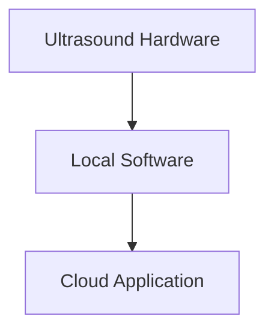
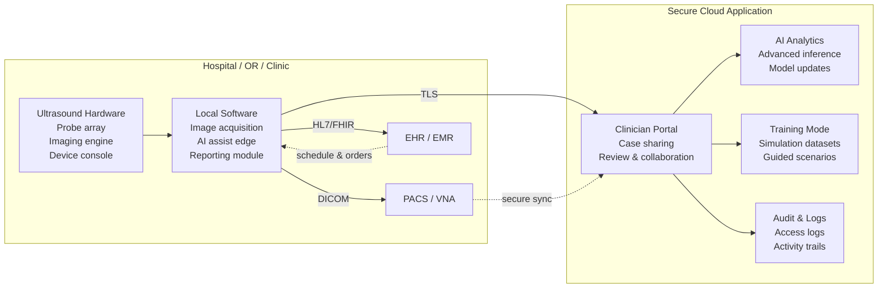
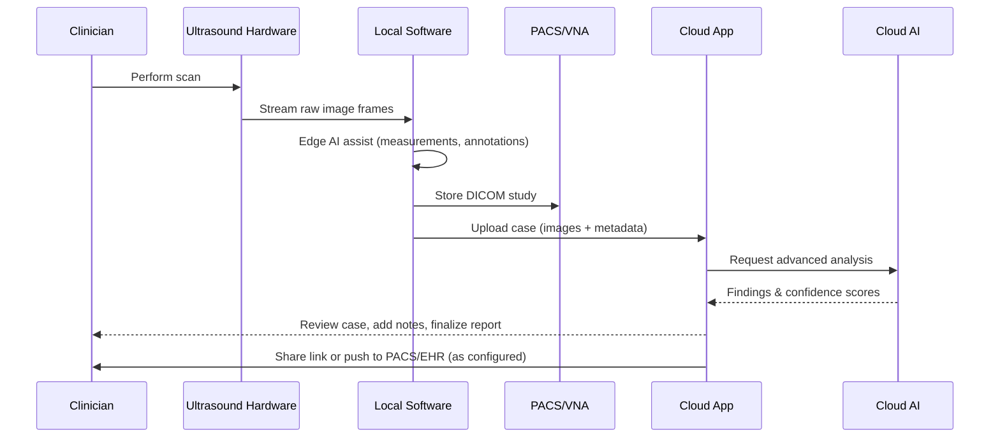
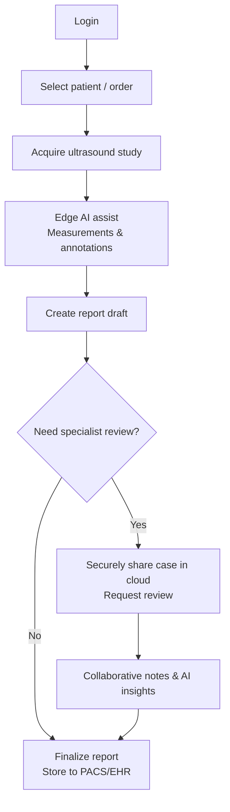

# 🩺 About MediBridge Ultrasound Suite

The **MediBridge Ultrasound Suite** is a fictional medtech solution designed to demonstrate how complex systems can be made **relatable, structured, and valuable** for clinicians, specialists, and healthcare providers.  

It combines:
- **Hardware**: High-resolution ultrasound device for urology and surgery  
- **Software**: AI-assisted image analysis and reporting tools  
- **Cloud Application**: Secure platform for sharing images, reports, and training material across teams  

---
# 📚 MediBridge Documentation Hub

Welcome to the MediBridge Ultrasound Suite documentation.  
From here you can navigate to all related modules:

## 🔗 Repositories
- [About MediBridge](https://github.com/BridgingKnowledge/Medibridge-Ultrasound-Suite)
- [MediBridge Training](https://github.com/BridgingKnowledge/medibridge-training)
  - [Clinicians](https://github.com/BridgingKnowledge/medibridge-training-clinicians)
  - [Specialists](https://github.com/BridgingKnowledge/medibridge-training-specialists)
  - [Developers](https://github.com/BridgingKnowledge/medibridge-training-developers)
- [MediBridge Troubleshooting](https://github.com/BridgingKnowledge/medibridge-troubleshooting)
---
## 🎯 Purpose
MediBridge was created to:
- Support clinicians with faster, more accurate diagnostics  
- Enable collaboration across departments and locations  
- Provide training and education tools for continuous learning  
- Demonstrate how an Application Specialist can bridge knowledge between technology and clinical practice  

---

## 🌍 Key Features
- **AI Diagnostics**: Automated detection of anomalies in ultrasound scans  
- **Workflow Integration**: Seamless connection to hospital IT systems (EHR, PACS)  
- **Cloud Collaboration**: Share cases securely with colleagues and specialists  
- **Training Mode**: Built-in simulation for education and onboarding  

---

## 👩‍⚕️ Target Users
- **Clinicians**: Urologists, surgeons, and radiologists  
- **Application Specialists**: Supporting installation, training, and optimization  
- **Healthcare IT**: Ensuring integration and compliance with standards  
- **Developers**: Extending functionality, building integrations, and maintaining APIs  

---

## 🔗 System Overview

This section provides a simple high-level overview of the system, showing how the hardware, local software, and cloud application connect:

## 🏥 Detailed Architecture
This diagram shows how onsite components (hospital/clinic) connect with the secure cloud application:

## 🔄 Data Flow
This sequence diagram illustrates how data moves from the ultrasound scan to the final report:

## 👨‍⚕️ Typical Clinical Workflow
This flowchart shows a typical reporting workflow from login to final report:

💡 This fictional system is part of the BridgingKnowledge portfolio, created to showcase how complex medtech solutions can be explained, supported, and optimized for real-world use.
